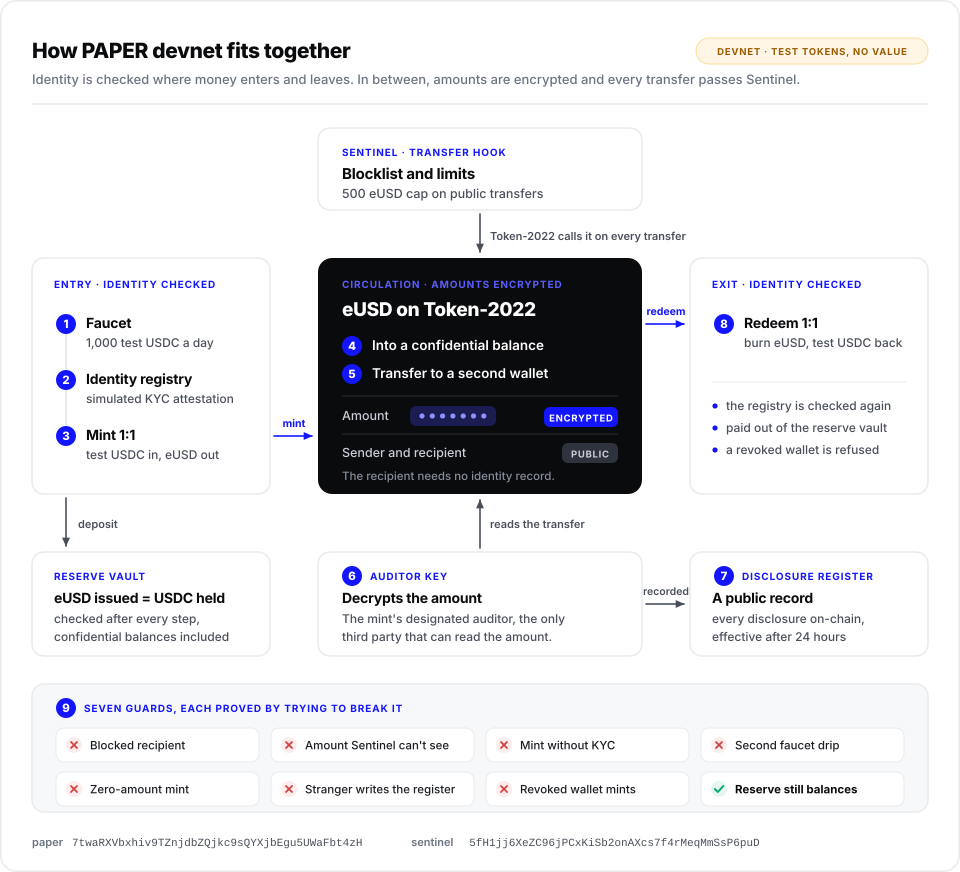

# PAPER devnet

[](https://github.com/softseco/paper-devnet/actions/workflows/ci.yml)
[](./LICENSE)

A working devnet prototype of the PAPER Protocol: a dollar token whose amounts are encrypted
on-chain, whose mint and redeem are gated by an identity registry, whose transfers are checked by an
on-chain compliance policy, and whose disclosures to an auditor are recorded in public.

> **Devnet only. Every token here is a test token with no value, and nothing on this page is an
> offer of anything.**



## What it shows

Identity is checked at the mint and redeem perimeter only. Between those two points the token moves
through Token-2022 confidential transfers, so the protocol does not know who holds what — and a
recipient needs no identity record at all to be paid.

One run of `scripts/demo.ts` walks the whole story on public devnet:

1. a faucet hands out test USDC
2. a simulated KYC partner writes a wallet into the Identity Whitelist Registry
3. the wallet deposits test USDC into the reserve vault and receives eUSD one for one
4. half of it moves into a confidential balance
5. a confidential transfer sends part of it to a second wallet, amount encrypted on-chain
6. the mint's designated auditor decrypts that amount — and nobody else can
7. a disclosure is recorded in a public register as a hash commitment, effective 24 hours later:
   the entry names no one, and the record behind it stays with the issuer
8. the first wallet withdraws the rest of its confidential balance and redeems its eUSD back out
   of the vault
9. seven guards are proved by trying to break them, and each refuses

Every step checks the reserve invariant: eUSD issued always equals test USDC held, confidential
balances included.

## On devnet

| | |
|---|---|
| `paper` program | [`7twaRXVbxhiv9TZnjdbZQjkc9sQYXjbEgu5UWaFbt4zH`](https://explorer.solana.com/address/7twaRXVbxhiv9TZnjdbZQjkc9sQYXjbEgu5UWaFbt4zH?cluster=devnet) |
| Sentinel (compliance hook) | [`5fH1jj6XeZC96jPCxKiSb2onAXcs7f4rMeqMmSsP6puD`](https://explorer.solana.com/address/5fH1jj6XeZC96jPCxKiSb2onAXcs7f4rMeqMmSsP6puD?cluster=devnet) |

## The program

| Instruction | What it is for |
|---|---|
| `initialize` | Config for one token: the eUSD mint, the test-USDC mint, the reserve vault, the KYC partner, the auditor. |
| `attest_identity` | The KYC partner marks a wallet as verified. On devnet a wallet may attest for itself. |
| `revoke_identity` | Closes the gate for a wallet without touching its balance. |
| `faucet_drip` | Mints test USDC to any wallet, once a day. |
| `mint_eusd` | A verified wallet deposits test USDC into the vault and receives eUSD 1:1. |
| `redeem_eusd` | A verified wallet burns eUSD and takes test USDC back 1:1. |
| `record_disclosure` | Writes a disclosure to the public register as a 32-byte commitment — no subject, no amount — effective 24 hours later. |

## Who sees what

| | Sees the amount | Sees the identity |
|---|---|---|
| The public | no | no — but addresses are public, so the transaction graph is |
| The recipient | yes | no |
| The mint's auditor | yes, by decrypting | no |
| The KYC partner | no | yes, at the perimeter only |
| The protocol | no | only at mint and redeem |

The reasoning, and the limits of this prototype, are in [SECURITY.md](./SECURITY.md).

## Built on

Two packages that existed **before** this hackathon (1.0, July 2026), disclosed as prior work:

- [`@softseco/confidential-transfers`](https://github.com/softseco/confidential-sdk) — Token-2022
  confidential transfers in TypeScript and Rust, including auditor selective disclosure.
- [`sentinel`](https://github.com/softseco/sentinel) — programmable compliance through a Token-2022
  transfer hook: allowlist, blocklist, per-transfer limit.

Work done during the hackathon (14 Sep – 12 Oct 2026): this program, this demo and its tests, the
[browser playground](https://softseco.github.io/confidential-sdk), three SDK releases and three
Sentinel releases. SDK 2.0.0 moved key derivation to the ecosystem standard. 2.1.0 added
transfer-hook account resolution for confidential transfers, without which a confidential transfer
on a mint with a hook fails with `MissingAccount`. 3.0.0 added `withdraw` and moved the SDK to
`@solana/kit` 8. Sentinel 2.0.0 made policies with a transfer limit handle confidential transfers
(the `allow_confidential` flag and four new tests), 2.0.1 was its first devnet deployment, and
2.0.2 was documentation and packaging. Since 0.2.0 this prototype runs on SDK 3.0.0.

## Disclosures without names

A public list of who was disclosed would tip those people off, and at full KYC an address is a
person. So each register entry holds only a commitment:

```
SHA-256( "PAPER-DISCLOSURE-v1" || index as u64 LE || SHA-256(canonical JSON of the record) || 32-byte salt )
```

The record — who asked, on what legal basis, which transactions — and the salt stay with the
issuer. A supervisor or an auditor who is given them recomputes the hash and checks it against the
entry; everyone else sees only that a disclosure happened and when. The code is in
[`scripts/disclosure.ts`](./scripts/disclosure.ts).

## Run it

```bash
npm ci                                           # dependencies, pinned by the lockfile
anchor build --no-idl -- --tools-version v1.57   # the flag is not valid in the IDL step
anchor idl build -o target/idl/paper.json        # so the IDL is built separately
anchor test --skip-build --provider.cluster localnet   # 11 tests, no devnet needed
npx tsx scripts/demo.ts                          # the full story, against devnet
```

The demo needs about 1.5 devnet SOL and a dedicated RPC endpoint (`DEVNET_RPC` / `DEVNET_WS`); the
public one refuses websocket connections partway through.

## What is deliberately not real here

- **The faucet mints test USDC out of thin air.** There is no reserve behind the reserve; the vault
  holds test tokens, and the invariant the demo checks is between them.
- **"Simulate KYC" lets a wallet vouch for itself.** That path exists so a visitor can try the flow,
  and it is the one thing in this repository that has no place in a real deployment.
- **The auditor and the KYC partner are the same key as the deployer** in the demo run. In the
  design they are separate parties.
- **Register entries from 0.1.0 still name their subject.** The upgrade changed what new entries
  hold, not the ones already written. The entry also keeps a coarse reason code and the requester's
  key, which the mainnet design drops.
- **Nothing here has been independently audited**, and the program's upgrade authority is a single
  key.

## License

Apache-2.0.
